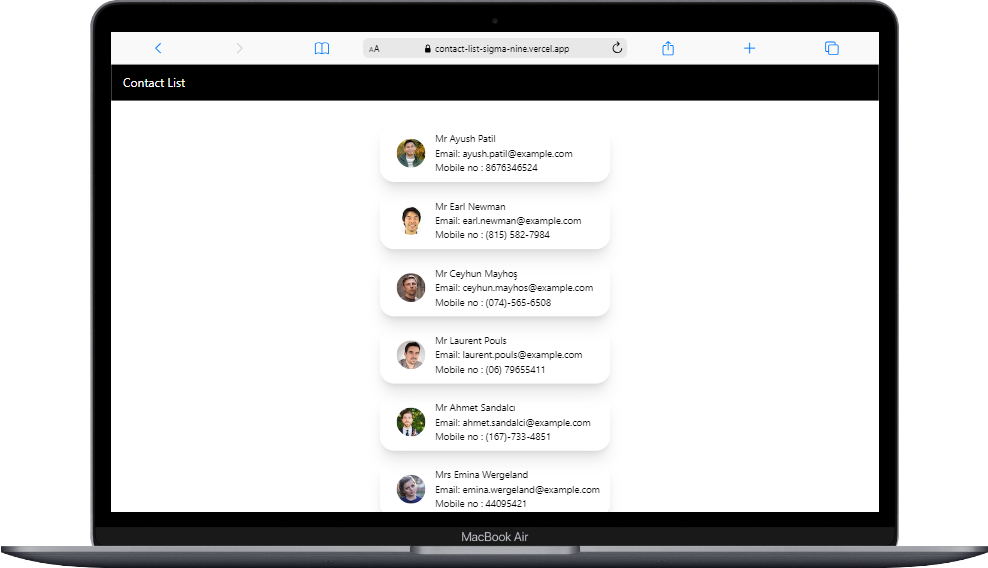
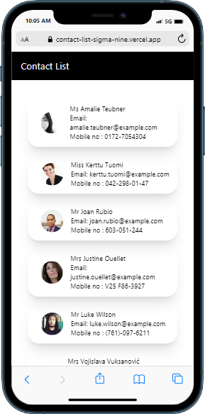

# Contact List

This is Basic Contact List web app. In this app you can get random contact from the randomuser.me api 

## Table of contents

- [Overview](#overview)
  - [Screenshot](#screenshot)
  - [Links](#links)
- [My process](#my-process)
  - [Built with](#built-with)
  - [What I learned](#what-i-learned)

## Overview

### Screenshot

### Links

- GitHub Repo URL: [Basic Contact List GitHub repo](https://github.com/faisgit/contact-list-)
- Live URL: [Contact List](https://contact-list-sigma-nine.vercel.app/)

## My process

### Built with

- Semantic HTML5 markup
- CSS custom properties
- Flexbox
- CSS Grid
- Mobile-first workflow
- [React](https://react.dev/) - JS library
- [Tailwind CSS](https://tailwindcss.com/) - CSS Framework
- [Daisy ui](https://daisyui.com/) - Tailwind Css Component Library
- [Random User](https://randomuser.me/) - It's a random user api

### What I learned

From this, Project i learn How to use React Js and how to use ustate hook, useffect hook, fetch data from api. I also learn how to use Tailwind CSS in any Project with daisy ui a tailwind css components library 
